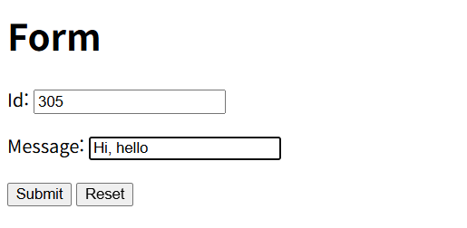
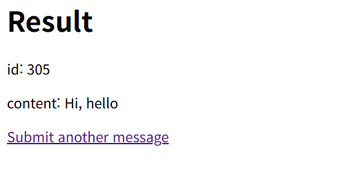

# Spring Guides: Handling Form Submission

---
## 1. 만든 것
* **개념**
  * Spring Boot와 Thymeleaf를 활용하여 웹 HTML Form 데이터를 생성, 제출 및 처리하는 SSR 웹 서비스 구축

* **주요 기능**
  * /greeting 경로로 HTTP GET 요청 시, 비어있는 DTO 객체를 담아 HTML 입력 폼 화면(greeting.html) 반환
  * 사용자가 id와 content를 입력 후 Submit 버튼 &rarr; HTTP POST 요청으로 서버에 데이터 제출
  * 제출된 폼 데이터를 `@ModelAttribute`로 수신 &rarr; 결과 화면에 동적으로 출력

---
## 2. 주요 기술 및 문법
### 1) HTTP GET / POST 요청 분기 핸들링
* 동일한 URL 엔드포인트(/greeting)에 대해 처리 목적에 따라 HTTP 메서드를 분기
* **GET**: 입력 폼 화면 렌더링용 (@GetMapping)
* **POST**: 사용자가 제출한 데이터 수신 및 결과 처리용 (@PostMapping)

### 2) Spring MVC Form Binding `@ModelAttribute`
* HTTP 요청 파라미터들을 자바 객체(DTO)의 필드와 1:1로 자동 매핑해 주는 어노테이션
* **동작 원리**
  1) 기본 생성자로 `Greeting` 객체를 생성
  2) HTTP 파라미터 이름과 일치하는 Setter 메서드(setId(), setContent())를 리플렉션으로 호출하여 값을 주입
  3) 바인딩 완료된 객체를 별도의 model.addAttribute() 없이도 View로 자동 전달

### 3) Thymeleaf Form 매핑 문법 (th:object와 th:field)
* `th:object="${greeting}"`: <form> 태그 내부에서 기본으로 사용할 자바 객체 1개를 지정
* `th:field="*{id}"`: th:object로 지정된 객체의 특정 필드(id)를 input 태그와 연결

### 4) 선택 변수 표현식(`*{...}`) vs 일반 변수 표현식(`${...}`)
* `*{field}`: 상위 태그에 th:object가 선언되어 있을 때만 사용하는 생략형/줄임말 표현식. (*{id})
* `${object.field}`: th:object 선언 유무와 관계없이 언제 어디서나 사용할 수 있는 정석 표현식. (${greeting.id})

### 5) Thymeleaf 리터럴 대체(Literal Substitution) 문법
* 기존의 문자열 결합 방식: `
` (작은따옴표와 + 연산자 필요)
* 리터럴 대체 방식: 

* 파이프 기호`| ... |`로 전체를 감싸면 문자열과 변수를 작은따옴표나 + 없이 직관적으로 조합 가능

---
## 3. 핵심 Annotation
| Annotation | 설명                                                                                 |
|:-----------|:-----------------------------------------------------------------------------------|
| **`@ModelAttribute`**     | Form을 통해 전송된 HTTP 파라미터들을 자바 객체(DTO)의 필드와 자동 바인딩 및 Model에 자동 등록 |

---
## 4. 발생한 문제 & 몰랐던 점
### 1) Whitelabel Error Page (500 Internal Server Error)
* **원인**
  * result.html에서 타임리프 변수명 오타로 인해 객체 탐색 실패(${greeing.content})
  * 결과 화면의 이동 링크 주소를 컨트롤러 URL(/greeting)이 아닌 파일명인 greeting.html로 작성
* **해결**
  * 오타 수정: ${greeting.content}
  * URL 경로 수정: href="/greeting"

### 2) model.addAttribute("greeting", new Greeting())에서 new 객체를 넘기는 이유
* HTML 폼 화면에서 사용자의 입력을 바인딩 받아올 빈 객체가 미리 선언되어 있어야 하기 때문
* addAttribute(key, value) 형태만 생각하느라, form에서 입력받을 객체가 필요한 것을 생각하지 못했음

---
## 5. 실행화면
### 1) Form 입력 화면 (GET, /greeting)

### 2) 결과 화면 (POST, /greeting)
